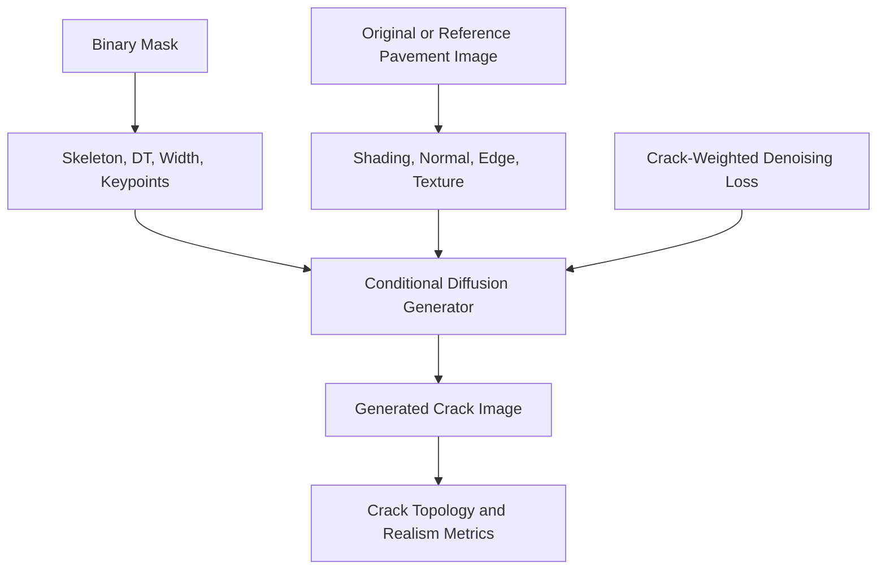

# 裂缝生成创新重构计划

## 当前判断

现有项目已经包含 ControlNet、DT 条件、CAFE、TAG、GAN baseline 与评测脚本。关键路径包括 [`/work/models/cafe.py`](/work/models/cafe.py)、[`/work/models/tag.py`](/work/models/tag.py)、[`/work/diffusers/examples/controlnet/train_controlnet.py`](/work/diffusers/examples/controlnet/train_controlnet.py)、[`/work/cracktree_dataset/cracktree_controlnet.py`](/work/cracktree_dataset/cracktree_controlnet.py)、[`/work/eval_diffusion_refresh/eval_dt_family.py`](/work/eval_diffusion_refresh/eval_dt_family.py)。

目前 CAFE/TAG 的主要问题是：它们改变了条件嵌入或特征缩放，但没有直接把裂缝的拓扑结构作为优化目标。评价结果也显示，通用指标和结构指标并不能稳定支持“CAFE/TAG 明显优于 baseline”的结论。因此建议不把 CAFE/TAG 作为主创新，而是作为消融模块保留。

另一个重要判断是：DT、skeleton、width map、endpoint/branchpoint 等条件大多来自 binary mask。它们不是新增观测信息，而是对同一裂缝结构信息的重编码。因此它们适合提升结构对齐和可控性，但不能单独解决路面纹理、光照、阴影、材质融合等真实感问题。

## 推荐主线：Structure-Appearance Guided Crack ControlNet

把论文方法定义为“结构-外观双条件约束的裂缝生成”，由四部分组成：

- 裂缝结构条件表示：将原来的 binary mask / DT 条件扩展为更易学习的结构场，例如 skeleton、distance transform、width map、endpoint/branch heatmap。ControlNet 本身接受 3 通道条件图，这条路线可以复用现有训练框架，风险较低。
- 路面外观条件表示：从原图或推理时的参考路面图中提取 shading/illumination、surface normal、edge map、texture/albedo 等条件，弥补 binary 派生条件无法提供真实感信息的问题。
- 裂缝区域加权去噪训练：在 ControlNet 训练 loss 中，对裂缝骨架及其邻域对应的 latent 区域提高权重，避免模型主要学习大面积路面背景而忽略细裂缝结构。
- 领域结构评价：新增连通分量数误差、骨架 Chamfer、endpoint/branchpoint F1、裂缝宽度分布误差、mask recall/precision 等指标，把论文贡献从“图像更像”转到“裂缝结构更可控、更符合条件”。

整体数据流可以表达为：

## 为什么比继续改 CAFE/TAG 更合适

CAFE 当前实现接近 ControlNet 原始 conditioning embedding 的卷积替换，文件中定义的 `SpatialAttention` 实际没有接入训练链路。TAG 当前是 Sigmoid 缩放，输出范围为 0 到 1，容易只起到整体抑制 ControlNet 残差的作用。如果训练预算较小，它们很难带来稳定提升。

新的主线直接对准裂缝任务的核心难点：细长结构、连通性、分叉、宽度、局部纹理和光照融合。结构条件负责“裂缝应该在哪里、如何连接、粗细如何”，外观条件负责“裂缝如何嵌入真实路面材质和光照中”。这比单纯叠加通用模块更容易形成自洽的论文贡献。

## 实验路线

第一组做公平性修正：统一 `train_linux.jsonl` / `train_linux_updated.jsonl`、统一评测 ID、统一 checkpoint 和推理设置，确认 baseline、DT、CAFE、TAG 的真实差距。

第二组做结构条件消融：比较 binary、DT、skeleton、width map、DT+skeleton+width/keypoint 三通道条件。这里的结论应谨慎表述为“binary 信息的有效重编码提升了结构可学习性”，而不是声称引入了全新信息。

第三组做外观条件消融：比较无外观条件、shading/illumination、normal、edge、texture/albedo。优先级建议为 shading 和 normal，因为它们比 depth 更可能影响路面裂缝的阴影、凹凸和材质融合。depth 可以作为候选，但不建议作为唯一主线，因为路面近似平面，单目深度对浅表裂缝可能不敏感。

第四组做训练目标消融：比较普通噪声 MSE 与裂缝区域加权 MSE，重点看骨架、端点、分叉和宽度指标。

第五组保留 CAFE/TAG：只作为附加消融，观察它们是否在新条件或新 loss 下有辅助作用。如果仍然不提升，就诚实写成“通用特征增强对细裂缝拓扑不敏感”，反而能支撑你提出任务专用方法的必要性。

第六组做现代模型外部验证：SD1.5-ControlNet 仍作为主实验平台，因为它稳定、可复现、训练成本可控；GAN 作为传统生成模型对照保留。但为避免 2026 年基线显旧，补充 SDXL-ControlNet、SD3-ControlNet 或 FLUX-ControlNet 的小规模验证，展示同样的结构/外观条件思想在更新模型上仍有意义。

## 论文表达建议

章节标题可以从“基于 CAFE/TAG 的 ControlNet 改进”改为“结构-外观双条件约束的裂缝条件扩散生成方法”。贡献点写成：

- 提出一种面向裂缝生成的结构条件编码，将骨架、距离场、宽度场和关键拓扑点作为 binary mask 的有效重编码输入 ControlNet。
- 提出一种路面外观条件注入策略，将光照、法线、边缘或纹理条件用于提升裂缝与路面背景的融合真实感。
- 提出裂缝区域加权的扩散去噪目标，提升细裂缝区域的结构保持能力。
- 构建面向裂缝生成的结构评价协议，补充 FID/PSNR/LPIPS 无法反映的连通性和拓扑一致性。
- 在 SD1.5-ControlNet 主实验之外，补充 SDXL/SD3/FLUX 等更新条件生成模型的小规模验证，说明方法关注的是裂缝结构与外观先验，而非绑定旧主干。

## 风险与备选

如果训练时间有限，优先做“结构条件图 + shading 条件 + 新指标”，因为这几乎不需要大改模型。若有足够算力，再加入加权 loss 和 normal/texture 条件。若现代模型验证成本过高，可以只做 SDXL-ControlNet 或 FLUX-ControlNet 的推理级展示，不把它作为主实验。若结果仍不明显，可以把重点放在可控性评价、外观一致性评价和失败案例分析，而不是强行追求所有通用指标超过 baseline。
